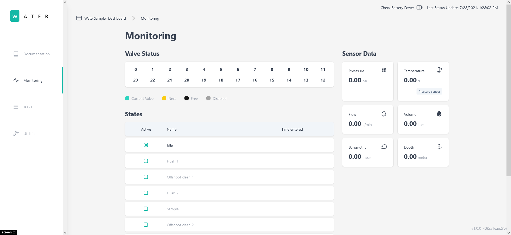

# WaterSamplerUI 🚀

WaterSamplerUI is a browser-based application intended to be used as the primary way for controlling the [WaterSamplerServer](https://github.com/OPEnSLab-OSU/WaterSamplerServer) backend. It is a modified version of ednaUI.

- Real-time status monitoring of sensor data and states
- Task configuration and management
- Utility functions
